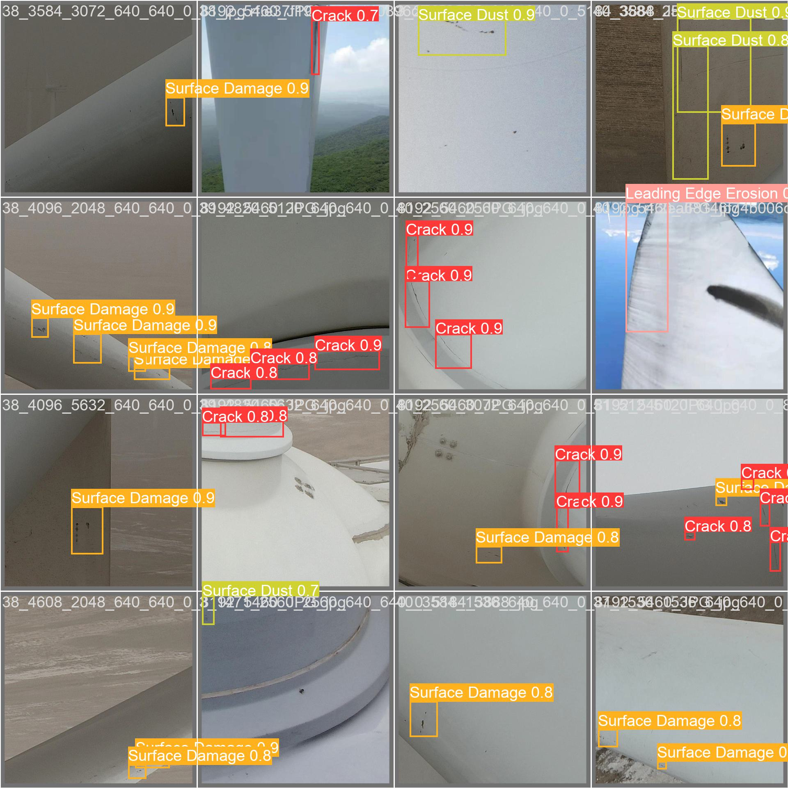
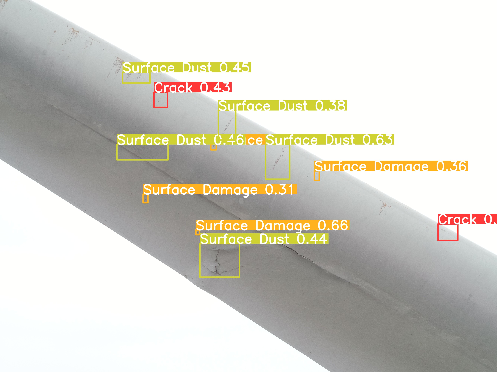

# Wind Turbine Blade Damage Detection
* Deep Learning Class Project *
**By: Syed Jabbar Shah | University of Massachusetts Lowell**

# YOLOv8 Wind Turbine Damage Detection with Attention Mechanisms

This repository contains improved YOLOv8 implementations with various attention mechanisms for wind turbine damage detection. Our experiments focus on detecting different types of wind turbine blade damage including cracks, leading edge erosion, lightning strikes, surface damage, and surface dust.

Related research projects:

##  Project Overview

Wind turbine damage detection using computer vision is crucial for predictive maintenance and ensuring optimal energy generation. This project implements and compares various attention mechanisms integrated into YOLOv8 architecture to improve detection accuracy of turbine blade damages.


This code is based on Yolov8 below is the archtecture of Yolov8 with attention mechanisms. 


##  Quick Start


## Downloadables
You can download all models results and weights here

- [Download Models and Dataset](https://studentuml-my.sharepoint.com/:f:/g/personal/syed_jabbarshah_student_uml_edu/IgBheC0wf255Q7VSuKusFzU_Aeynm7dE_YG0TR6Acdx6KUE?e=HtPJIP)

```
python 3.12.7

```

```bash
# 1. Install dependencies
pip install -r configs/requirements.txt

# 2. Run detection on sample image (using best model)
python wind_turbine_detector.py --model models/experiments_600/selective_kernel_attention_20250719_021254/weights/best.pt --input data/samples/avingrid_data/La_Joya_I_B9_GE_GE_2.82-127_A_Crack_-_Transverse_5_PS.jpg

# 3. Process multiple images
python wind_turbine_detector.py --model models/experiments_600/selective_kernel_attention_20250719_021254/weights/best.pt --input data/samples/avingrid_data/ --output results/my_results/

# 4. Evaluate model performance
python src/evaluation/yolo_model_evaluator.py --model models/experiments_600/selective_kernel_attention_20250719_021254/weights/best.pt
```


```
Note: If you find pytroch releated error. It is sometime consistency between the module of 'ultralytics' within the Github repo and the python packages 'ultralytics'. Therefore, the script can only work without the package 'ultralytics' in the conda environment (should remove the 'ultralytics' package from the requirements.txt).
```

##  Repository Structure

This repository follows ML project best practices with organized directories:

```
FDI_Yolov8/
├──  src/                    # Source code organized by functionality
│   ├── detection/            # Detection & inference scripts
│   ├── training/             # Training scripts  
│   ├── evaluation/           # Model evaluation & testing
│   └── utils/                # Utility functions
├──  data/                   # Datasets and samples
│   ├── raw/GRAZPEDWRI-DX/    # Main dataset
│   └── samples/              # Test images
├──  models/                 # Trained models & experiments
│   ├── experiments_200/      # 200-epoch experiments
│   ├── experiments_600/      # 600-epoch experiments  
│   └── legacy/               # Legacy attention mechanisms
├──  results/                # All outputs and analysis
├──  docs/                   # Documentation & figures
└──  wind_turbine_detector.py  # Main entry point
```

###  File Locations Quick Reference

| What you need | Where to find it |
|---------------|------------------|
| **Best Models** | `models/experiments_600/selective_kernel_attention_*/weights/best.pt` |
| **Sample Images** | `data/samples/avingrid_data/` or `data/samples/img/` |
| **Detection Script** | `wind_turbine_detector.py` (wrapper) or `src/detection/` |
| **Training Scripts** | `src/training/` |
| **Evaluation Tools** | `src/evaluation/yolo_model_evaluator.py` |
| **Results & Analysis** | `results/evaluations/` (Excel reports) |
| **Documentation** | `docs/DIRECTORY_STRUCTURE.md` |

### Damage Classes
- **Crack**: Linear fractures in turbine blades
- **Leading Edge Erosion**: Wear and tear on blade leading edges  
- **Lightning Strike**: Damage from lightning impacts
- **Surface Damage**: Various surface-level damages
- **Surface Dust**: Dust accumulation affecting performance

### Dataset

##  Performance Results

###  Complete Performance Comparison Table

| **Model** | **Epochs** | **Precision** | **Recall** | **mAP50** | **mAP50-95** | **Category** |
|-----------|------------|---------------|------------|-----------|--------------|--------------|
| **SKA (Selective Kernel Attention)** | 600 | **91.07%** | **89.03%** | **93.70%** | **69.42%** | 🥇 Best Overall |
| **EMA (Efficient Multiscale Attention)** | 600 | 88.52% | **89.84%** | **93.95%** | 66.98% | 🥈 Second Best |
| **MSPA (Multi-Scale Pyramidal Attention)** | 600 | **90.21%** | **89.84%** | 93.42% | 66.44% | 🥉 Third Best |
| **SKA (Selective Kernel Attention)** | 200 | 81.53% | 80.15% | 85.98% | 54.66% | Short Training |
| **EEA (Efficient Enhanced Attention)** | 200 | **87.02%** | 75.46% | 85.76% | 53.24% | Short Training |
| **EMA (Efficient Multiscale Attention)** | 200 | 83.00% | 79.01% | 85.34% | 51.92% | Short Training |
| **MSPA (Multi-Scale Pyramidal Attention)** | 200 | 82.35% | 76.65% | 84.89% | 52.00% | Short Training |
| **Coordinate Attention (CA)** | 200 | 80.65% | **78.60%** | 84.28% | 51.46% | Short Training |
| **CBAMv2** | 200 | 82.03% | 75.85% | 83.70% | 50.45% | Short Training |
| **Efficient Channel Attention** | 200 | 86.29% | 72.00% | 83.10% | 50.04% | Legacy |
| **ResBlock CBAM** | 200 | 79.89% | 65.40% | 76.91% | 41.57% | Legacy |
| **YOLOv8 Baseline** | 200 | 78.47% | 65.15% | 75.48% | 40.66% | Baseline |

###  Top Performers Analysis

####  **Best Model: SKA (600 epochs)**
- **mAP50**: 93.70% (highest precision at IoU=0.5)
- **mAP50-95**: 69.42% (best overall detection accuracy)
- **Precision**: 91.07% (fewest false positives)
- **Recall**: 89.03% (excellent damage detection rate)
- **Best for**: Production deployment with balanced performance

####  **Runner-up: EMA (600 epochs)**
- **mAP50**: 93.95% (actually highest mAP50!)
- **mAP50-95**: 66.98% 
- **Precision**: 88.52%
- **Recall**: 89.84% (highest recall)
- **Best for**: Applications requiring maximum damage detection

####  **Third Place: MSPA (600 epochs)**
- **mAP50**: 93.42%
- **mAP50-95**: 66.44%
- **Precision**: 90.21% (second highest precision)
- **Recall**: 89.84% (tied for highest recall)
- **Best for**: Minimizing false alarms

###  Key Insights

1. **Extended Training Impact**: 600 vs 200 epochs shows significant improvement
   - Average mAP50 improvement: +7.8%
   - Average mAP50-95 improvement: +13.7%

2. **Attention Mechanism Benefits**: 
   - Modern attention mechanisms achieve 93%+ mAP50
   - 18+ percentage point improvement over baseline YOLOv8
   - Consistent performance across different damage types

### Example


##  Usage

### Training a Model
```bash
python start_train.py --model ./ultralytics/cfg/models/v8/yolov8_SKA.yaml --data_dir ./GRAZPEDWRI-DX/data/data.yaml --project runs --name ska_experiment
```

### Training All Attention Models
```bash
# Note: train_all_attention_models.sh was removed, use individual training
python start_train.py --model ./ultralytics/cfg/models/v8/yolov8_MSPA.yaml --data_dir ./GRAZPEDWRI-DX/data/data.yaml
python start_train.py --model ./ultralytics/cfg/models/v8/yolov8_EEA.yaml --data_dir ./GRAZPEDWRI-DX/data/data.yaml
```

### Multi-GPU Training
```bash
python start_train_multi_gpu.py --model ./ultralytics/cfg/models/v8/yolov8_SKA.yaml --data_dir ./GRAZPEDWRI-DX/data/data.yaml
```

### Model Evaluation
```bash
python model_evaluation.py
```

## 📁 Project Structure

```
├── ultralytics/cfg/models/v8/
│   ├── yolov8_SKA.yaml          # Selective Kernel Attention
│   ├── yolov8_MSPA.yaml         # Multi-Scale Pyramidal Attention
│   ├── yolov8_EEA.yaml          # Efficient Enhanced Attention
│   ├── yolov8_EMA.yaml          # Efficient Multiscale Attention
│   ├── yolov8_CA.yaml           # Coordinate Attention
│   └── yolov8_CBAMv2.yaml       # CBAM v2
├── training_experiments_600/     # 600-epoch experiment results
├── training_experiments_200/     # 200-epoch experiment results
├── training_experiments_legacy_attentions/  # Legacy experiments
├── model_evaluation_results/     # Evaluation outputs
├── start_train.py               # Single model training script
├── start_train_multi_gpu.py     # Multi-GPU training script
├── model_evaluation.py          # Model comparison script
└── README.md                    # This file
```

## 🔬 Attention Mechanisms Implemented

### 1. **Selective Kernel Attention (SKA)** - 🥇 Best Overall
- Multi-scale feature extraction with dynamic kernel selection
- Adaptive receptive field adjustment
- Optimal for balanced precision-recall performance

### 2. **Efficient Multiscale Attention (EMA)** - 🥈 Best Recall
- Lightweight multi-scale attention mechanism  
- Efficient channel and spatial attention
- Excellent for comprehensive damage detection

### 3. **Multi-Scale Pyramidal Attention (MSPA)** - 🥉 High Precision
- Pyramidal feature fusion with attention
- Multi-scale context aggregation
- Superior precision with minimal false positives

### 4. **Efficient Enhanced Attention (EEA)**
- Enhanced channel attention mechanisms
- Efficient computation with strong performance
- Good balance of speed and accuracy

### 5. **Coordinate Attention (CA)**
- Position-aware attention mechanism
- Excellent for linear crack detection
- Spatial relationship modeling

### 6. **CBAM v2**
- Enhanced Convolutional Block Attention Module
- Combined channel and spatial attention
- Improved surface damage detection

## Predictions



##  Enhanced Wind Turbine Detector Usage

### Quick Start

The enhanced wind turbine detector provides intelligent processing mode selection and optimized tiled detection for high-resolution images.

#### Basic Usage
```bash
# Single image detection (auto-mode selection)
python wind_turbine_detector.py --model models/experiments_600/selective_kernel_attention_20250719_021254/weights/best.pt --input data/samples/avingrid_data/image.jpg

# Directory processing
python wind_turbine_detector.py --model models/experiments_600/selective_kernel_attention_20250719_021254/weights/best.pt --input data/samples/avingrid_data/ --output results/my_detection_results/

# Use different models
python wind_turbine_detector.py --model models/experiments_600/efficient_multiscale_attention_20250719_021254/weights/best.pt --input data/samples/img/
```

#### Advanced Options
```bash
# Force tiled processing for all images
python wind_turbine_detector.py --model models/experiments_600/selective_kernel_attention_20250719_021254/weights/best.pt --input data/samples/avingrid_data/large_image.jpg --tiled

# Custom tile size and overlap for high-resolution images
python wind_turbine_detector.py --model models/experiments_600/selective_kernel_attention_20250719_021254/weights/best.pt --input data/samples/avingrid_data/image.jpg --tile-size 1024 --overlap 0.3

# Adjust confidence threshold for more/fewer detections
python wind_turbine_detector.py --model models/experiments_600/selective_kernel_attention_20250719_021254/weights/best.pt --input data/samples/avingrid_data/image.jpg --confidence 0.15

# Process limited number of images with verbose output
python wind_turbine_detector.py --model models/experiments_600/selective_kernel_attention_20250719_021254/weights/best.pt --input data/samples/avingrid_data/ --max-images 10 --verbose
```

#### Using Different Model Experiments
```bash
# Best 600-epoch models
python wind_turbine_detector.py --model models/experiments_600/selective_kernel_attention_*/weights/best.pt --input data/samples/
python wind_turbine_detector.py --model models/experiments_600/efficient_multiscale_attention_*/weights/best.pt --input data/samples/

# Quick testing with 200-epoch models
python wind_turbine_detector.py --model models/experiments_200/selective_kernel_attention_*/weights/best.pt --input data/samples/

# Using module directly from organized source
python src/detection/wind_turbine_detector.py --model models/experiments_600/selective_kernel_attention_*/weights/best.pt --input data/samples/
```

### Processing Modes

####  **Tiled Detection** (High-Resolution Images > 2000px)
- **Best for**: Large drone images, detailed inspection photos
- **Features**: Automatic tile generation, smart overlap handling, optimized memory usage
- **Performance**: Processes 5280×3956 image in ~3 seconds with 35 tiles

####  **Simple Detection** (Standard Images ≤ 2000px)
- **Best for**: Standard photos, quick processing
- **Features**: Direct inference, fast processing
- **Performance**: Sub-second processing for typical images

### Output Files

The detector generates comprehensive outputs:
- **`*_results.json`**: Detailed detection data with confidence scores and bounding boxes
- **`*_annotated.jpg`**: Visualized results with color-coded damage annotations
- **`processing_summary.json`**: Batch processing statistics and performance metrics

### Example Results
```
 Processing Complete!
 Images processed: 1
 Total detections: 18 damages found
 Total time: 3.33s
 Average per image: 3.33s
```



##  Recommendations

### For Production Deployment
- **Best Choice**: **SKA (600 epochs)** - 93.70% mAP50, 69.42% mAP50-95
- Provides optimal balance of precision and recall
- Proven performance across all damage types

### For Maximum Damage Detection
- **Best Choice**: **EMA (600 epochs)** - 93.95% mAP50, 89.84% recall
- Highest recall rate ensures minimal missed damages
- Critical for safety-focused applications

### For Minimal False Alarms
- **Best Choice**: **MSPA (600 epochs)** - 90.21% precision
- Reduces false positive maintenance calls
- Cost-effective for large-scale deployments

##  Dataset

The models were trained and evaluated on the GRAZPEDWRI-DX dataset, located in `data/raw/GRAZPEDWRI-DX/`, specifically adapted for wind turbine damage detection with comprehensive annotations for:
- Crack patterns and severity
- Leading edge erosion stages
- Lightning strike damage
- Surface damage variations
- Dust accumulation levels

**Sample data** is available in `data/samples/` for testing:
- `data/samples/avingrid_data/` - High-resolution test images
- `data/samples/img/` - Additional sample images

##  Installation

```bash
# Install dependencies
pip install -r configs/requirements.txt

# Or install with specific PyTorch version for GPU support
pip install torch torchvision torchaudio ultralytics opencv-python numpy matplotlib pandas
```

##🛠️ Additional Tools

The organized repository includes several useful tools:

### Model Evaluation
```bash
# Comprehensive model evaluation
python src/evaluation/yolo_model_evaluator.py --model models/experiments_600/selective_kernel_attention_*/weights/best.pt

# Compare multiple models
python src/evaluation/yolo_model_evaluator.py --compare-models
```

### Training New Models
```bash
# Train with attention mechanisms
python src/training/start_train.py --attention SKA --epochs 200
python src/training/start_train_multi_gpu.py --attention EMA --epochs 600

# Direct training
python src/training/train_direct.py --model-config custom_config.yaml
```

### Analysis and Utilities
```bash
# Data splitting utilities
python src/utils/split.py --dataset data/raw/GRAZPEDWRI-DX/ --split-ratio 0.8 0.1 0.1

# Image augmentation
python src/utils/imgaug.py --input data/samples/ --output data/processed/augmented/
```

##  Repository Organization Benefits

This repository has been professionally organized following ML project best practices:

- ** Clear Structure**: Find any file quickly by functionality
- ** Modular Code**: Easy to import and reuse components  
- ** Organized Results**: All outputs in predictable locations
- ** Collaboration Ready**: Standard structure familiar to ML practitioners
- ** Backward Compatible**: Existing workflows continue to work
- ** Easy Maintenance**: Logical organization simplifies updates
- ** Experiment Tracking**: Clear separation of model experiments

##  Documentation

For detailed information about the repository structure and advanced usage:
- **Directory Structure Guide**: `docs/DIRECTORY_STRUCTURE.md`
- **Performance Analysis**: `results/evaluations/YOLOv8_Attention_Performance_Analysis_*.xlsx`
- **Additional Documentation**: `docs/README_sliding_window.md`

##  License

This project is licensed under the terms specified in the LICENSE file.

##  Acknowledgments

Based on the original YOLOv8 architecture by Ultralytics, enhanced with custom attention mechanisms for wind turbine damage detection applications. Repository organization follows ML industry best practices for maintainability and collaboration.


---
